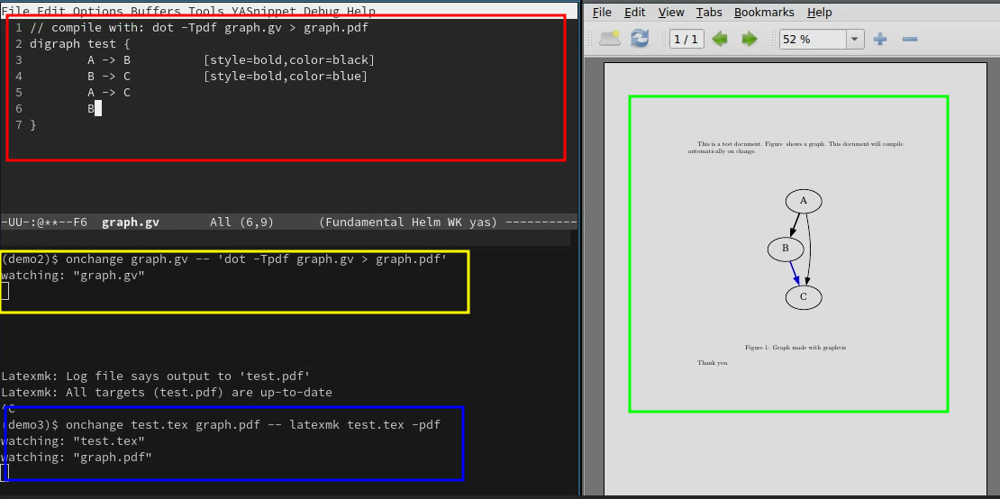

# Introduction
OnChange is a CLI utility that can run commands when it detects changes on the files you ask it to watch. 

The syntax is: `onchange file1 file2... -- command`. You have to separate the command with `--` or you can have no command if you only want to see the changes. There are other flags like the template for change message, and flags for async execution of the command. 

The async flag will help you if you don't want to miss on other changes when the command is executing, each command will be executed in a thread with this flag.

# Demo

Here in this image, the pdf is shown in green box (right), which is being compiled anytime the `.tex` file or `graph.pdf` file is changed (blue box). And the `graph.pdf` file is generated every time `graph.gv` file is changed (yellow box). So when you change the graviz file (red box), the `graph.pdf` is updated and then the final pdf. Hence, you can use it when you need to review changes without having to re-compile stuffs.

[Video Demo](https://youtu.be/PbEqUU-tBXQ)

# Help

`onchange --help` will give you the help menu with usage details.

    Usage: onchange [OPTIONS] <WATCH>... [-- [COMMAND]...]
    
    Arguments:
      <WATCH>...    List paths to watch
      [COMMAND]...  Command to run
    
    Options:
      -d, --duration <DURATION>  Scan duration in miliseconds [default: 500]
      -r, --recursive            Watch in Recursive Mode
      -a, --async                Run commands on Async
      -t, --template <TEMPLATE>  List paths to watch [default: "Change Detected: {path}"]
      -h, --help                 Print help

The templates for the file change detect, and the command can have few variables. Pass the template with these variables inside curly braces `{}`. Remember to escape the curly braces itself.

| Variable | Value                                      |
|----------|--------------------------------------------|
| path     | full path of the changed file              |
| dir      | directory (parent) of the changed file     |
| name     | filename of the changed file               |
| ext      | extension of the changed file (includes .) |
| name.ext | name and extension of the changed file     |

For example: you can do `onchange --recursive . --template '{path}'` to watch any file change in a working directory. Similarly, you can use other variables to be creative with the commands.

# Inspiration
The need to have something run on file change is everywhere, and I had been using a shell script for latex files to compile when the file changed. But since I might need it for lots of other stuffs too, like the graphviz example here. I thought of making a program to specialize in it. 

Till now, I don't know if there are other programs that already do it, so if you know any better option let me know. 
